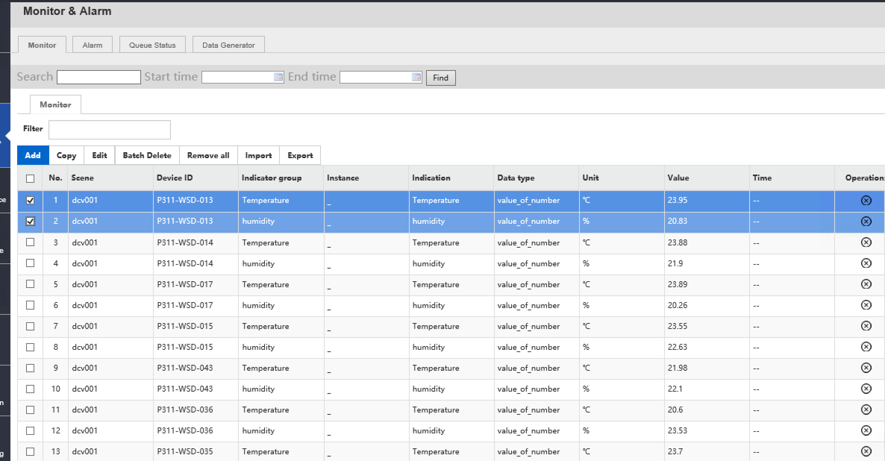
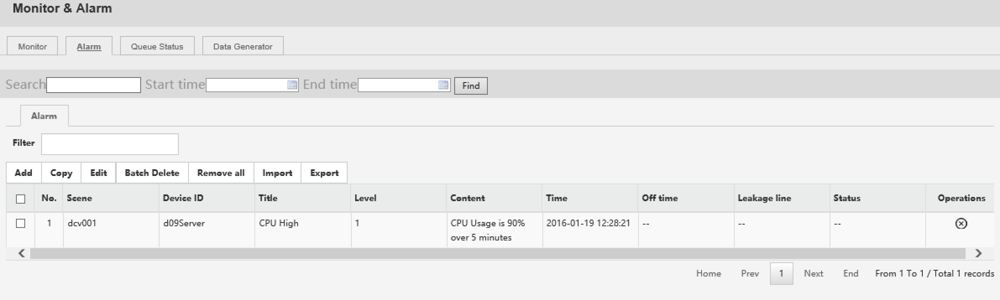

********************************
Monitor and Alarms
********************************

uDCV supports monitoring visualization by receive performance and alarm data from 3-party system via its open API, and show the index in realtime 3D scene. Typical data source could be:

* IT equipment performance and alerting 
* Datacenter room temperature and humidity 
* UPS/PDU/Air Conditioning electrical power 

For more information about send performance and alarm data thought uDCV open API, please refer to uDCV Developer Guide.

Performance 
=================

Performance data management functions is located under **Monitor and Alarm** -> **Monitor** :

|

User can perform following operation on performance data as listed in table below:

.. csv-table:: **Performance Data Management**
    :header: Action Name, Description
    :widths: 30, 70

    Add New Performance Data, "Add performance data manually 

    .. image:: images/monitor_2.png

    "
    Copy, Copy one data record to an new one.
    Edit, Edit existing data record.
    Batch Delete, Delete selected data records.
    Remove All, Delete *ALL* performance records.
    Import, "Import data from local disk file, in excel format."
    Export, "Export data to local disk file, in excel format."

Alarms
========

Alarm data management functions is located under **Monitor and Alarm** -> **ALarms** :

|

User can perform following operation on alarm data as listed in table below:

.. csv-table:: **Alarm Data Management**
    :header: Action Name, Description
    :widths: 30, 70

    Add New Alarm Data, "Add alarm data manually 

    .. image:: images/monitor_4.png

    "
    Copy, Copy one data record to an new one.
    Edit, Edit existing data record.
    Batch Delete, Delete selected data records.
    Remove All, Delete *ALL* alarm records.
    Import, "Import data from local disk file, in excel format."
    Export, "Export data to local disk file, in excel format."

Queue Status
==============

Status of data processing queue can be view under **Monitor and Alarm** -> **Queue Status** . it summaries the following information:

* Queue Name
* Number of pending messages
* Number of consumers
* Messages dequeue 
* Message enqueue

Data Generator
===============

User can generate performance records using **Data Generator** for **demo** purpose. Data Generator function is located at **Monitor and Alarm** -> **Data Generator**. One of the typical user case is to generate data to build **HeatMap** from a group of temperature sensors.

To generate sample data, the following fields are required:

* Scene Name
* Category
* Target, either ``logic server`` or ``Temperature and Humidity``, or both

.. csv-table:: **Data Generator**
    :header: Action Name, Description
    :widths: 30, 70

    Run, "Start the Data Generator 

    .. image:: images/monitor_5.png
       :width: 320px

    "
    Stop, "Stop the Data Generator

    .. image:: images/monitor_6.png
       :width: 320px

    "

