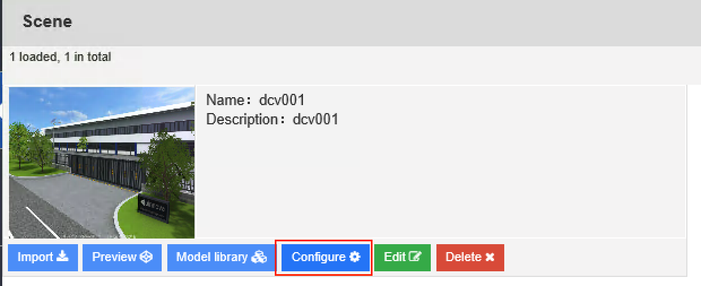

********************************
Asset Management
********************************

In uDCV, each scene has its own asset dataset, to access asset management UI for a scene, go to scene list, click ``configure`` button under scene panel, as shown below:

|

User can perform following operation on alarm data as listed in table below:

.. csv-table:: **Asset Data Management**
    :header: Action Name, Description
    :widths: 30, 70

    Add New Asset Data, "Add asset data manually 

    .. image:: images/asset_2.png

    "
    Copy, Copy one data record to an new one.
    Edit, Edit existing data record.
    Batch Delete, Delete selected data records.
    Remove All, Delete *ALL* asset records.
    Import, "Import data from local disk file, in excel format."
    Export, "Export data to local disk file, in excel format."