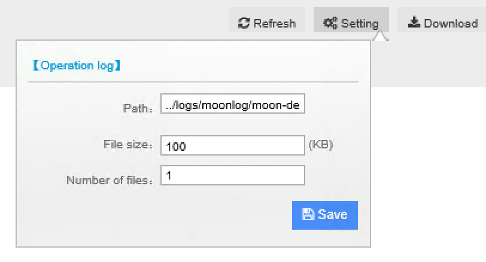

********************************
Misc Management Functions
********************************

License
========

* View license information by click **License** tag on left navigation bar.
* To renew license, click ``relicense`` link on license information page.
* Get obtain machine code required to apply new license, click ``Click to copy license code`` button on the right hand side.

System Log
============

System log, includes operation log and exceptions, can be viewed online under **System log** tab.

* ``Refresh`` to refresh log
* ``Setting`` to configure the logger

* ``Download`` to download log to local disk

Advance UI Settings
===================

uDCV 3D scene UI can be customized to meet different user scenario under **Preference** tab, please contact uinnova or your sale representative for further details.