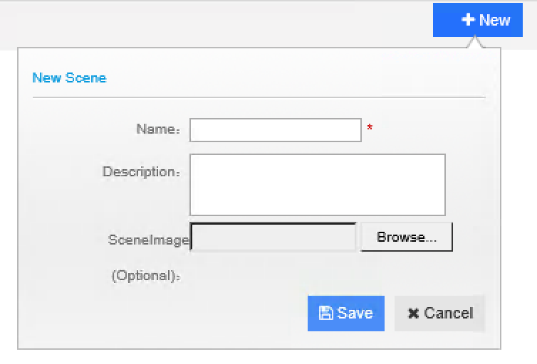
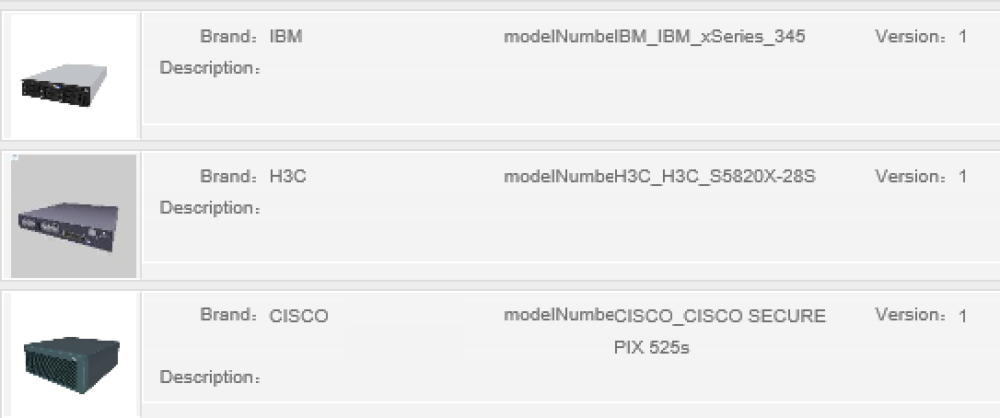
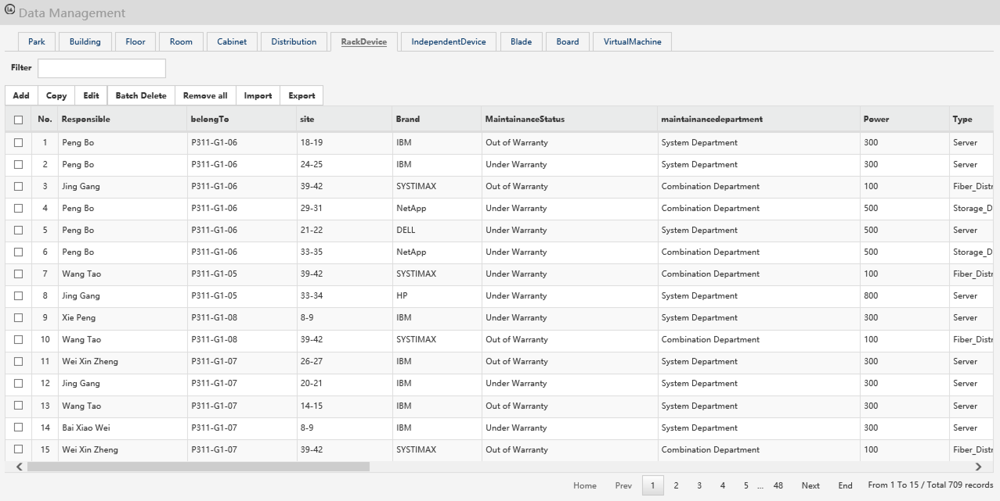

********************************
Scene Management
********************************

By scene management UI, administrator can create new scene, upload 3D model of datacenter, product library, asset and wiring data to scene, as well as preview scene thought T3D plug-in. 

To access Scene Management module, click **Scene** button on the left-hand navigation bar in the **Management Console**

Below is the major steps to create 3D datacenter scene:

Create 3D model in online uDCB
===============================

uinnova provides online datacenter modelling tool called uDCB (uinnova DataCenter Builder) for **FREE**. Utilizing the WYSIWYG UI, uDCB enables users to design and build 3D datacenter with great flexibility and freedom. 

uDCB is a comprehensive online design platform, where users can simply drag and drop objects into the drawing. CAD and Visio drawings can be easily imported into the uDCB to create a 3D model. 

uDCB supports online viewing and community based sharing. Users can share their design with others, which effectively increase the number of availables templates for everyone.

Please refer to http://uinnova.com/dcb.html for further information.

Export uDCB Model to Local Disk
================================
After drawings DataCenter 3D model online in uDCB, click **Export** button to export datacenter model to local disk.

Create New Scene
=================
1. Click **+New** button on the upper right corner in **Scene** management UI
2. Input scene information on the popup window, as shown below:

3. Click **Save** button to save your change.

.. note::

  Newly created scene by click **New** button are empty, to put 3D modelas, objects and asset data in new scenes, please use **import** function under scene panel.

Import Scene Data
==================
Click **import** button under individual scene panel to enter data import UI. Import data by following order

1. import model library
3. import uDCB model 
4. import asset data 
5. import wiring data 

Import Model library
^^^^^^^^^^^^^^^^^^^^^^^
Click **Model Library** icon in scene import UI, select model library file from popup file explorer windows, and click **OK** to upload.

The **Model Library** icon will turn to green if upload successfully.

.. note::

   uDCV shipped with default model library named ``product_lib.zip`` under ``DCV_DATA`` folder in product tarball.

Import uDCB Scene
^^^^^^^^^^^^^^^^^^
Click **uDCB** icon in scene import UI, select uDCB exported scene file from popup file explorer windows, and click **OK** to upload.

The **uDCB** icon will turn to green if upload successfully.

.. note::

   For sample datacenter scenes and exported scene files, please visit http://uinnova.com/app/topic/35/sample-exported-scene-and-asset-data

Import Texture 
^^^^^^^^^^^^^^^
Click **Texture** icon in scene import UI, select texture file from popup file explorer windows, and click **OK** to upload.

The **Texture** icon will turn to green if upload successfully.

.. note::

   uDCV shipped with default texture file named ``unity_pic.zip`` under ``DCV_DATA`` folder in product tarball.

Import Asset Data
^^^^^^^^^^^^^^^^^^
Click **Asset** icon in scene import UI, select asset file from popup file explorer windows, and click **OK** to upload.

The **Asset** icon will turn to green if upload successfully.

.. note::

   To learn about asset file format and sample asset data, please visit http://uinnova.com/app/topic/35/sample-exported-scene-and-asset-data

Import Wiring Data
^^^^^^^^^^^^^^^^^^^^^^
Click **Wiring** icon in scene import UI, select wiring file from popup file explorer windows, and click **OK** to upload.

The **Wiring** icon will turn to green if upload successfully.

.. note::

   To learn about wiring file format and sample wiring data, please visit http://uinnova.com/app/topic/35/sample-exported-scene-and-asset-data

View Uploaded Scene Data
^^^^^^^^^^^^^^^^^^^^^^^^^^^^^^^
* View model library of individual scene by click **Model Library** button under scene panel

* View asset data of individual scene by click **Configure** button under scene panel

Preview Scene
==============
Click **Preview** button under individual scene panel to preview scene in 3D.

