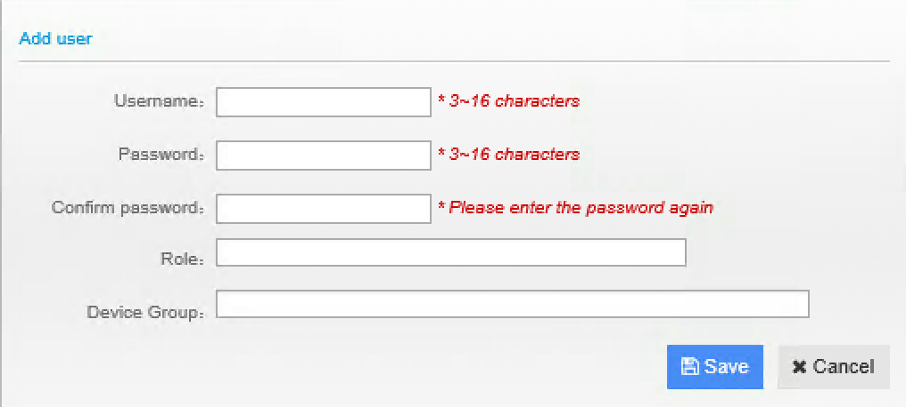
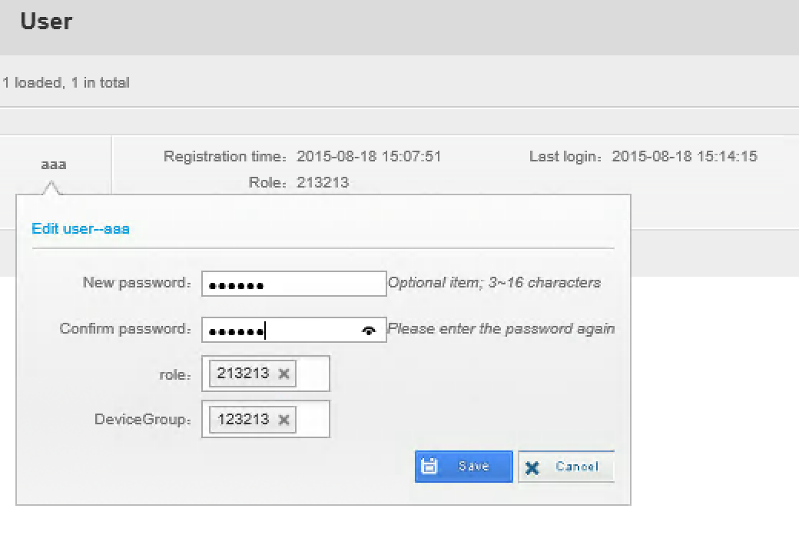
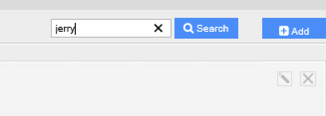

********************************
User Management
********************************

User Management module has following functions:

* Search, create, modify and delete uDCV user.
* Assign roles to user.
* Assign device group to user.
  
To access User Management module, click **User** button on the left-hand navigation bar in the **Management Console**

Add New User
=============

1. Click **+Add** button on the upper right corner in **User** management UI
2. Input user information on the popup window, as shown below:

3. Click **Save** button to save new user.

Edit Existing User
===================
1. Select user to be edit from user list under **User** management UI, and click edit icon on the right hand side
2. Modify user information on the popup window, as shown below:
   

   
3. Click **Save** button to save change.

Delete User
============
1. Select user to be deleted from user list under **User** management UI, and click delete icon on the right hand side.
2. Click **OK** to confirm delete. Click **Cancel** to cancel operation.

Search User
============
1. Input search criteria in the search box on upper right corner of **User** management UI and click **Search** button.

2. View search results on user list table of **User** management UI

